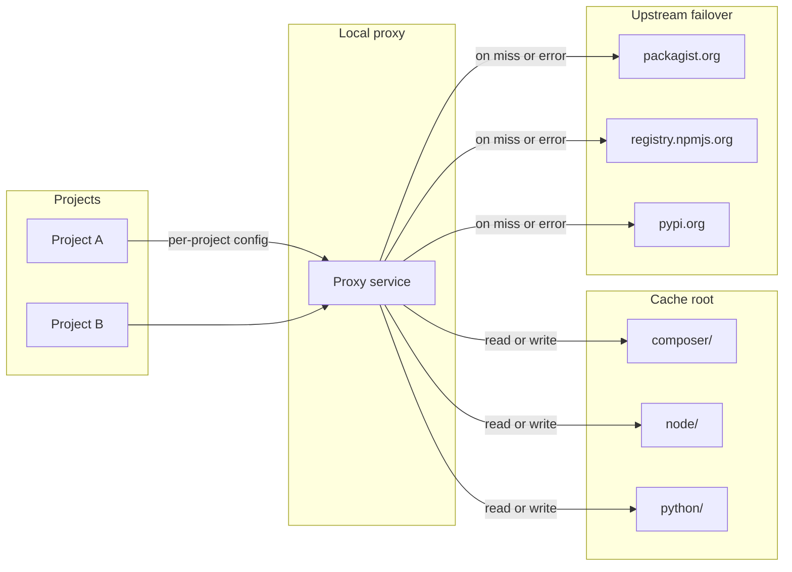
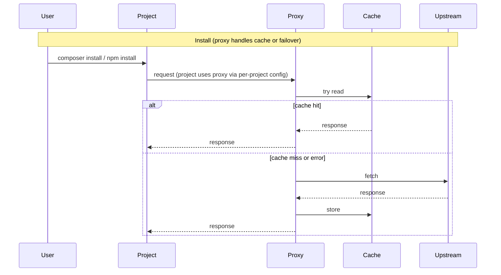

# Local Composer, Node, and Python Package Cache – Architecture

## 1. Goal and scope

- **Goal:** Re-run `composer install`, `npm install`, and Python installs (`pip install`, `poetry install`) in a project without network access, by using a local cache and proxy. The cache is **machine-wide** (all projects on this machine), not tied to any single vendor or product.
- **Primary scenario:** One developer machine (e.g. laptop); design should allow later use on a shared LAN or CI if desired.
- **Out of scope for v1:** Full registry mirrors (e.g. full npm mirror); focus is a *machine-scoped* read-through cache plus optional pre-populate from lockfiles.

---

## 2. High-level architecture

- **Primary mechanism: local read-through proxy.** A local HTTP(S) service intercepts requests to packagist.org, registry.npmjs.org, and pypi.org (and optionally other registries). On each request it tries the local cache first; on cache miss or when the cache is corrupted/unavailable it **fails over to the upstream registry**, fetches from the internet, stores the result in the cache, and returns it. No manual env vars are required for normal use once a project is configured to use the proxy (see per-project setup below).
- **Optional pre-populate:** A separate step can run `composer install` / `npm ci` / `pip install` / `poetry install` against one or more project paths (with the proxy as registry/index) to seed the cache from lockfiles before going offline.
- **Minimize project impact:** Composer, npm, and pip use **global/user-level** config so project files (composer.json, .npmrc, .pip) are never modified and other developers are not affected. Poetry remains per-project (pyproject.toml). **Automate** config via setup-project (global Composer repo, user .npmrc, user pip config, and per-project Poetry source).
- **Failover:** If the local cache or proxy is corrupted or unavailable, clients must **naturally fall back to the real upstream registries** (packagist, npm registry, PyPI) so that work can continue without the cache.

---

## 3. Components

### 3.1 Cache layout (single root)

- **Cache root:** One directory (e.g. `~/.local-package-cache` or configurable via `LOCAL_PACKAGE_CACHE_ROOT`) containing:
  - **composer/** – Composer cache (or symlink to `COMPOSER_HOME/cache`). Composer expects `files` and `repo` (metadata) layout.
  - **node/** – npm (and optionally pnpm) cache. npm expects `_cacache` (content-addressable) and optionally `_npm`; pnpm uses its own store layout.
  - **python/** – PyPI cache: simple index pages, JSON metadata, and package files (wheels/sdists) from pypi.org and files.pythonhosted.org.
- **Metadata (optional):** A small manifest (e.g. `cache.json`) recording last populate time, project paths, and lockfile hashes so the tool can warn when lockfiles changed after last populate.

### 3.2 Populate (online)

- **Inputs:** Path(s) to project directories that contain `composer.lock`, `package-lock.json` (or `pnpm-lock.yaml`), `requirements.txt` / `requirements.in`, or Poetry `pyproject.toml`.
- **Process:**
  - Set `COMPOSER_HOME` (or `COMPOSER_CACHE_DIR`) to cache root's `composer` (or equivalent so Composer writes into our tree).
  - Set `npm_config_cache` to cache root's `node` (and equivalent for pnpm if supported).
  - Run `composer install` in each PHP project, `npm ci` (or `pnpm install`) in each Node project, and for Python: `pip install -r requirements.txt` (or `pip-sync` / `pip install -r requirements.in`) and `poetry install` where applicable. Projects must be configured to use the proxy (setup-project) so traffic goes through the cache.
- **Output:** Cache directories filled with all artifacts needed for those lockfiles. Optional: write manifest with lockfile hashes and timestamps.

### 3.3 Install flow (proxy-first)

- **Normal use:** After setup (3.5), Composer/npm/pip use global/user config and point at the local proxy. User runs normal `composer install`, `npm install` (or `pnpm install`), and `pip install -r requirements.txt` or `poetry install`; package managers talk to the proxy, which serves from cache or fails over to upstream. No env vars needed (pip uses user `~/.config/pip/pip.conf`).
- **Optional env-based path:** If not using the proxy, script or docs can set:
  - `COMPOSER_HOME` / cache dir → cache root's `composer`
  - `npm_config_cache` → cache root's `node`
  - `COMPOSER_DISABLE_NETWORK=1` (or run with `--no-plugins` and no network).
  - For npm: `npm install --prefer-offline --no-audit`. Prefer proxy + per-project config to minimize project impact.

### 3.4 Local proxy (required)

- A local HTTP(S) proxy service is a **required** component. It:
  - **Composer:** Responds to packagist.org metadata and dist URL requests. On each request: try local cache first; on miss or on cache read error (e.g. corrupted file), **fail over to upstream** (packagist), fetch, store in cache, return response.
  - **npm:** Same for registry.npmjs.org and tarball URLs: try cache first, on miss or error **fail over to upstream**, then store and return.
  - **Python (PyPI):** Proxies pypi.org (simple index, JSON API) and files.pythonhosted.org (wheels/sdists). Responses from pypi.org are rewritten so package file URLs point at the proxy, so pip/Poetry fetch files through the cache. Try cache first; on miss or error **fail over to upstream**, then store and return.
- **Failover behavior:** If the proxy process is down or the cache directory is missing/corrupted, projects must still work. Prefer proxy-side failover: when the proxy cannot read from cache it proxies to upstream and returns the response. So no manual env or config change is needed when the cache is bad; if the proxy is down, see per-project setup for how to point back to upstream.
- Projects use the proxy via **global/user config** for Composer, npm, and pip (see 3.5); only Poetry uses per-project config (pyproject.toml).

### 3.5 Setup (scripted)

- **Goal:** Minimize project impact and ease reuse. Composer, npm, and pip use **global/user-level** config so composer.json, .npmrc, and project .pip are never modified (avoids breaking other developers). Only Poetry uses per-project config (pyproject.toml). **Automate** so the developer does not have to set env vars or edit config by hand.
- **Script:** A command such as `pkg-cache setup-project /path/to/project` (or `pkg-cache setup-project` when run from inside the project) that:
  - Detects project type (Composer, npm, pnpm, Python pip/pip-tools, Poetry, or any combination).
  - Configures installs to use the local proxy:
    - **Composer:** `composer config --global repo.packagist composer http://127.0.0.1:<port>/composer` (global config; does not modify composer.json).
    - **npm/pnpm:** Writes or updates **user** `~/.npmrc` (or `npm config get userconfig`) with `registry=http://127.0.0.1:<port>/` (does not modify project .npmrc).
    - **Python (pip):** Writes or updates **user** `~/.config/pip/pip.conf` with `index-url = http://127.0.0.1:<port>/pypi/simple/` (does not modify project .pip).
    - **Python (Poetry):** Adds `[[tool.poetry.source]]` to `pyproject.toml` with the proxy URL and `default = true`, and sets `poetry config repositories.pkg-cache` (--local).
  - Optionally backs up existing repo/registry/source settings and documents how to revert (for failover or use upstream only).
- **Reuse:** Running the same script on another machine (or in another clone) configures that machine to use the cache proxy for Composer/npm/pip (global/user); Poetry remains per-project.

---

## 4. Data flow (populate vs install)

---

## 5. Technology and implementation choices

- **Language:** Script-first (shell) for populate and env setup is sufficient; alternatively Node or PHP CLI for better parsing of lockfiles and cross-platform paths. Recommend starting with **shell (bash/zsh)** for macOS/Linux and a small Node or Python script if Windows support is required.
- **Composer:** Use official Composer; no need to reimplement. Control via `COMPOSER_HOME`, `COMPOSER_CACHE_DIR`, `COMPOSER_DISABLE_NETWORK`.
- **npm:** Use official npm; control via `npm_config_cache` and `--prefer-offline`. For pnpm, use `pnpm store path` and point to a store under cache root.
- **Lockfiles:** Prefer `composer.lock` and `package-lock.json` (and `pnpm-lock.yaml` if supporting pnpm) so the set of packages is deterministic when populating.

---

## 6. Configuration and UX

- **Cache root:** Env var `LOCAL_PACKAGE_CACHE_ROOT` or config file under home dir; default `~/.local-package-cache`.
- **Commands (suggested):**
  - `pkg-cache setup` or `./setup.sh` – **bootstrap for new machine:** one script that installs/checks deps (Composer, Node/npm), creates cache root layout, builds or installs the proxy, starts the proxy (or documents how to start it), and optionally runs a quick self-check. Goal: after one script run, the cache and proxy are up and running on a new laptop.
  - `pkg-cache setup-project [path]` – per-project config so the project uses the local proxy (see 3.5); no env vars required for normal use.
  - `pkg-cache populate [paths...]` – populate cache from one or more project dirs (with network, via proxy).
  - `pkg-cache status` – report cache size, proxy status, last populate time, lockfile vs cache consistency (optional).

---

## 7. Security and robustness

- **Integrity:** Rely on Composer's and npm's built-in verification (checksums in lockfiles). No need for custom signing in v1.
- **Failover:** Proxy and tooling must **naturally fail over to upstream registries** when the local cache is corrupted or unavailable (or when the proxy is down and the user reverts project config to upstream). No manual env vars should be required to recover.
- **Disk:** Cache can grow large; optional `pkg-cache prune` (e.g. by age or by "only keep packages referenced by manifest") can be a later addition.

---

## 8. Deliverables (implementation order)

1. **Architecture doc (this document)** – persist as `docs/ARCHITECTURE.md` or `ARCHITECTURE.md` in repo root.
2. **Bootstrap/setup script** – single entry point (e.g. `setup.sh` or `pkg-cache setup`) for **new machine setup:** creates cache root (`~/.local-package-cache` or `LOCAL_PACKAGE_CACHE_ROOT`), ensures proxy and cache layout exist, installs or checks Composer and Node/npm, starts or documents starting the proxy, and runs a quick self-check. Goal: one script call to have the cache up and running on a new laptop.
3. **Local proxy** – HTTP(S) service for Composer (packagist) and npm (registry + tarballs) with read-through cache and **failover to upstream** on miss or error.
4. **Cache layout** – cache root structure (composer + node dirs) created by bootstrap; document in README.
5. **Per-project setup script** – `pkg-cache setup-project [path]` that writes project-local config (Composer repo, `.npmrc`) so projects use the proxy without env vars; ease reuse across machines/clones.
6. **Populate script** – `pkg-cache populate [paths...]` that runs composer install / npm ci for given projects (via proxy) to seed the cache from lockfiles.
7. **README** – usage (run setup once on new machine, run setup-project per project, then composer install / npm install as usual; natural failover when cache unavailable), requirements, and config (cache root, proxy port).
8. **Optional:** Lockfile-hash manifest, `pkg-cache status`, `pkg-cache prune`; Windows-friendly wrapper.

---

## 9. Assumptions and limits

- **Assumptions:** Composer and npm (and optionally pnpm) are installed; projects use lockfiles; single machine or shared cache path (e.g. NFS) for team.
- **Limits:** Cache is only as good as the last populate (or first request via proxy); adding new dependencies requires going online so the proxy can fetch and store. No built-in full registry mirror in v1.

This gives a clear path to implement a machine-wide local Composer and Node package cache with a required local proxy, scripted per-project setup, natural failover to upstream, and a single bootstrap script for new machine setup.
